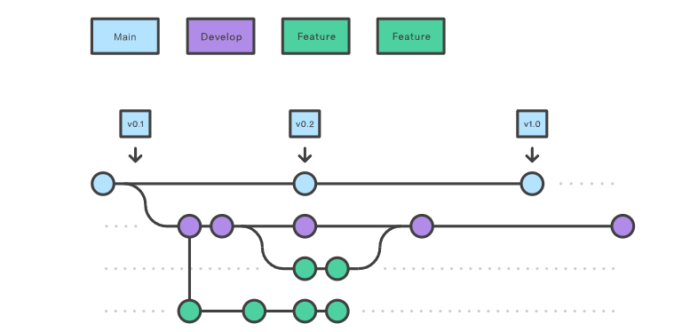
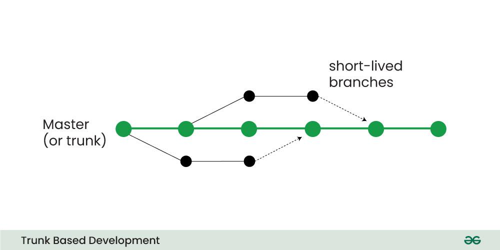
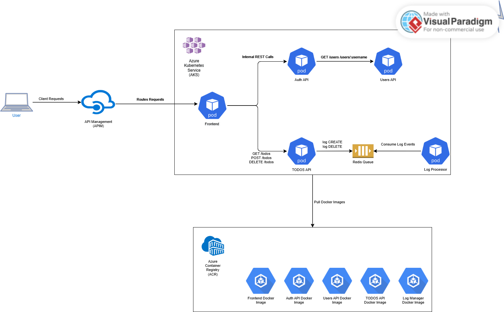

# Microservice App - PRFT Devops Training

## By

- Juan Pablo Niño
- Yuluka Gigante

---

## Table of contents

1. [Overview](#overview)
   - [Components](#components)
   - [Original Architecture](#original-architecture)
2. [Branching Strategy for Development](#branching-strategy-for-development)
3. [Branching Strategy for Operations](#branching-strategy-for-operations)
4. [Infraestructure](#infrastructure)
   - [Resource Description](#resource-description)
   - [Docker Images](#docker-images)
   - [Network Diagram](#network-diagram)
5. [Design Patterns](#design-patterns)
6. [Automation](#automation)
   - [Pipelines for Develoment](#pipelines-for-development)
   - [Pipelines for Infraestructure](#pipelines-for-infraestructure)

---

## Overview

This repository contains the solution to an academic exercise in which we were asked to deploy the project in the cloud, using an infrastructure defined by us.

The project is a TODO application designed in a microservice architecture. Each microservice is written in different programming language or frameworks (Go, Python, Vue, Java, and NodeJS).

### Components

In each folder you can find a more in-depth explanation of each component:

1. [Users API](/users-api) is a Spring Boot application. Provides user profiles. At the moment, does not provide full CRUD, just getting a single user and all users.
2. [Auth API](/auth-api) is a Go application, and provides authorization functionality. Generates [JWT](https://jwt.io/) tokens to be used with other APIs.
3. [TODOs API](/todos-api) is a NodeJS application, provides CRUD functionality over user's TODO records. Also, it logs "create" and "delete" operations to [Redis](https://redis.io/) queue.
4. [Log Message Processor](/log-message-processor) is a queue processor written in Python. Its purpose is to read messages from a Redis queue and print them to standard output.
5. [Frontend](/frontend) Vue application, provides UI.

### Original architecture

This is the original architecture of the project:


---

## Branching Strategy for Development

For the development team, we have chosen to adopt the **GitFlow** branching strategy. GitFlow provides a well-defined and structured approach to version control, making it highly suitable for agile development environments.

One of the main reasons behind this choice is its widespread adoption in the industry. Many developers are already familiar with GitFlow, which significantly reduces the onboarding time and minimizes the learning curve. This familiarity helps the team stay productive from the start and avoids the friction that can come with introducing a new branching model.

By following GitFlow, we can clearly separate feature development, releases, and hotfixes—ensuring stability in our main and release branches while enabling parallel development across multiple features.


**_Basic Flow_**

---

## Branching Strategy for Operations

For infrastructure and operations, we will follow a simplified branching strategy inspired by **Trunk-Based Development**. This approach emphasizes continuous integration of small, frequent changes into a single long-lived branch—typically called `trunk` or `main`.

Operational changes will be made through short-lived branches with the prefix `infra/*`. These branches will be created for specific infrastructure tasks (e.g., `infra/update-nginx-config`) and merged back into the trunk branch (`infra/dev`) once validated.


**_Basic Flow_**

We chose this strategy because it is particularly effective for infrastructure workflows as it:

- Encourages rapid iteration and testing of infrastructure code.
- Minimizes branching complexity and potential merge conflicts.
- Aligns well with Infrastructure as Code (IaC) practices, where quick feedback and small, reversible changes are ideal.
- Facilitates better automation and integration with CI/CD pipelines, as changes are continuously merged and validated.

---

## Infrastructure

To provision and manage the infrastructure for our microservices-based application, we used **Terraform** as our Infrastructure as Code (IaC) tool. Terraform allows us to define, version, and automate infrastructure changes consistently across environments.

The core infrastructure was deployed on **Microsoft Azure**, and it is designed to support a containerized microservices architecture with high availability, scalability, and centralized API management.

We chose to use Kubernetes as the core orchestration platform for our application because it allows us to deploy, scale, and manage containerized workloads with high granularity and control. Also, it integrates seamlessly with Azure through AKS, offering built-in monitoring, security, and autoscaling. By using Kubernetes, we ensure our architecture is portable, resilient, and aligned with modern cloud-native practices—facilitating future growth and service decoupling without major architectural changes.

### Resource Description

To do this, we created the following resources:

- **Resource Group**

  We created an Azure Resource Group called `microservices_rg` to encapsulate all components of the solution:

  ```hcl
  resource "azurerm_resource_group" "microservices_rg" {
    name     = var.resource_group_name
    location = var.location
  }
  ```

- **Azure Kubernetes Service (AKS)**

  AKS serves as the orchestration layer for all our microservices. It provides:

  - Auto-scaling capabilities
  - Integrated monitoring
  - Role-Based Access Control (RBAC)
  - Native support for Azure networking and identity

  The cluster is provisioned using Terraform with a configurable node pool, enabling flexibility for different workloads:

  ```hcl
  resource "azurerm_kubernetes_cluster" "aks_cluster" {
    name                = var.aks_name
    location            = azurerm_resource_group.microservices_rg.location
    resource_group_name = azurerm_resource_group.microservices_rg.name
    dns_prefix          = "microservices"

    default_node_pool {
      name       = "default"
      node_count = var.aks_node_count
      vm_size    = var.aks_node_vm_size
    }

    identity {
      type = "SystemAssigned"
    }

    role_based_access_control_enabled = true

    network_profile {
      network_plugin = "azure"
    }
  }
  ```

- **Azure Container Registry (ACR)**

  ACR is used to store and manage Docker images for our services. It integrates seamlessly with AKS, allowing the cluster to pull images securely without additional authentication setups:

  ```hcl
  resource "azurerm_container_registry" "acr" {
    name                = var.acr_name
    resource_group_name = azurerm_resource_group.microservices_rg.name
    location            = azurerm_resource_group.microservices_rg.location
    sku                 = "Standard"
    admin_enabled       = true
  }
  ```

- **Azure Redis Cache**

  We deployed a Redis instance to act as a caching and queuing layer, particularly used by our [`log-message-processor`](log-message-processor/) service to handle transient message storage and decoupled communication:

  ```hcl
  resource "azurerm_redis_cache" "redis_queue" {
    name                = var.redis_name
    location            = azurerm_resource_group.microservices_rg.location
    resource_group_name = azurerm_resource_group.microservices_rg.name
    capacity            = 2
    family              = "C"
    sku_name            = "Standard"
  }
  ```

- **API Management (APIM)**

  APIM centralizes access to all APIs in the platform. It enables:

  - Rate limiting
  - Logging
  - Security policies
  - Versioning and staging

  This is critical for maintaining control over public-facing APIs. We created it as follows:

  ```hcl
  resource "azurerm_api_management" "apim" {
    name                = var.apim_name
    location            = azurerm_resource_group.microservices_rg.location
    resource_group_name = azurerm_resource_group.microservices_rg.name
    publisher_name      = var.apim_publisher_name
    publisher_email     = var.apim_publisher_email
    sku_name            = "Developer_1"
  }
  ```

- **Kubernetes Namespace**

  To logically separate our services within the AKS cluster, we defined a dedicated namespace using the Kubernetes provider in Terraform:

  ```hcl
  resource "kubernetes_namespace" "microservices_ns" {
    metadata {
      name = var.k8s_namespace
    }
  }
  ```

### Docker Images

Each microservice is containerized using a `Dockerfile`. These images are uploaded to our ACR, so that the AKS can extract and deploy them.

For this purpose, each microservice has its own `*-deployment.yml` file.

### Network Diagram

Here is the netowrk diagram of the project:



---

## Design patterns

As part of the solution's architecture, three cloud design patterns were incorporated to improve scalability, reliability, and observability:

- **Caché-Aside**

  Although not used in its strictest form, we leveraged a Redis-based message queue that behaves similarly by temporarily storing transient data for asynchronous processing. While Redis is typically associated with caching, in our case it functions as a messaging buffer for the [`log-message-processor`](log-message-processor/) service—enhancing performance and decoupling components without relying on direct synchronous interactions.

- **API Gateway**

  We implemented the **API Gateway** pattern using Azure API Management (APIM). This allows us to expose all microservices through a unified entry point. APIM handles routing, rate limiting, logging, and versioning, while enforcing security policies centrally. This pattern simplifies client integration and future-proofs the platform for external consumption.

- **Health Endpoint Monitoring**

  This pattern is very useful to ensure system resilience. Each microservice exposes a dedicated health check endpoint, allowing us to monitor the application's status in real time. Also, Kubernetes uses these endpoints via `livenessProbe` and `readinessProbe` declarations in the deployment manifests to know the system state. These probes enable Kubernetes to detect when a container is unhealthy and restart it automatically or temporarily remove it from the service mesh until it recovers. This approach improves reliability, aids observability, and provides better insight into the behavior of services in a distributed environment.

---

## Automation

This project incorporates a three pipelines,using GitHub Actions, to ensure reliability, consistency, and automation across our microservices and infrastructure. Two of them are prepared to test and deploy the changes in the code, while the last one is designed to apply the changes on the infraestructure.

### Pipelines for Development

The first pipeline, [**Pull Request CI - Microservices**](.github/workflows/ci-pull-request.yml), is **triggered on every pull request** targeting either the `master` or `infra/dev` branches. Its main objective is to **validate the Docker builds for each microservice** (auth-api, frontend, users-api, todos-api, and log-message-processor) and perform a Kubernetes manifest dry-run against the Azure Kubernetes Service (AKS) cluster. This ensures that any new code doesn't break the build or contain invalid Kubernetes configurations. Additionally, it notifies a Discord channel of the pipeline outcome, providing immediate feedback to the development team.

The second pipeline, [**Deploy to Azure Kubernetes Service**](.github/workflows/deploy.yml), runs upon **every push** to the `master` or `infra/dev` branches. It is responsible for **building and pushing Docker images to the Azure Container Registry (ACR)**, dynamically **updating the image references** in the Kubernetes manifests, and **deploying them to AKS**. It also ensures that necessary secrets, such as the Redis password, are created or updated securely within the Kubernetes cluster. A rollout restart is performed to guarantee that all changes are reflected across the services. This pipeline automates the continuous delivery process, allowing seamless deployment of production-ready changes.

### Pipelines for Infraestructure

The pipeline [**Terraform - Infrastructure**](.github/workflows/infra.yml) is designed for **infrastructure management**. It **executes on pushes** to relevant branches **that affect Terraform files**, or manually via workflow dispatch. This pipeline installs the required Terraform version, authenticates with Azure, and performs a full terraform init, validate, and plan. When changes are pushed to the master branch, it automatically applies the infrastructure changes using the configuration defined in the repository. It also includes Discord notifications to inform the team of the status of infrastructure changes.
